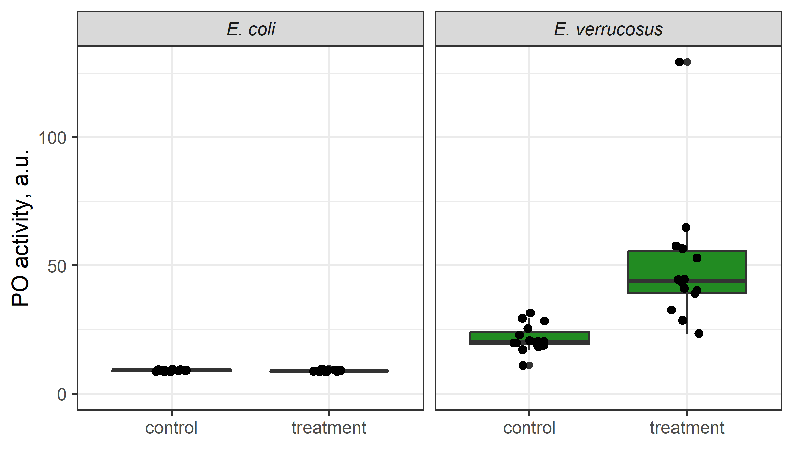
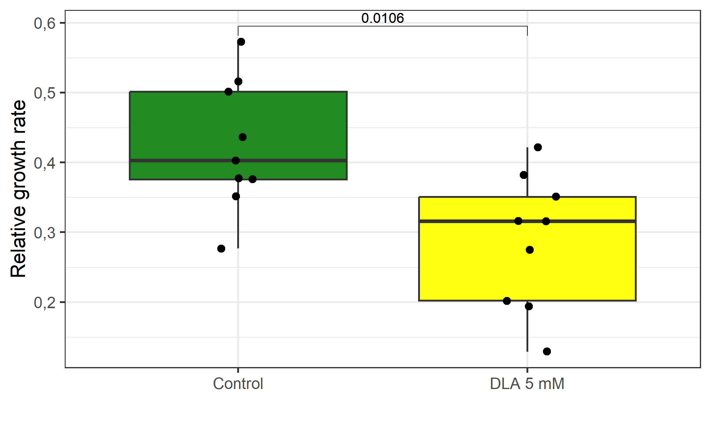
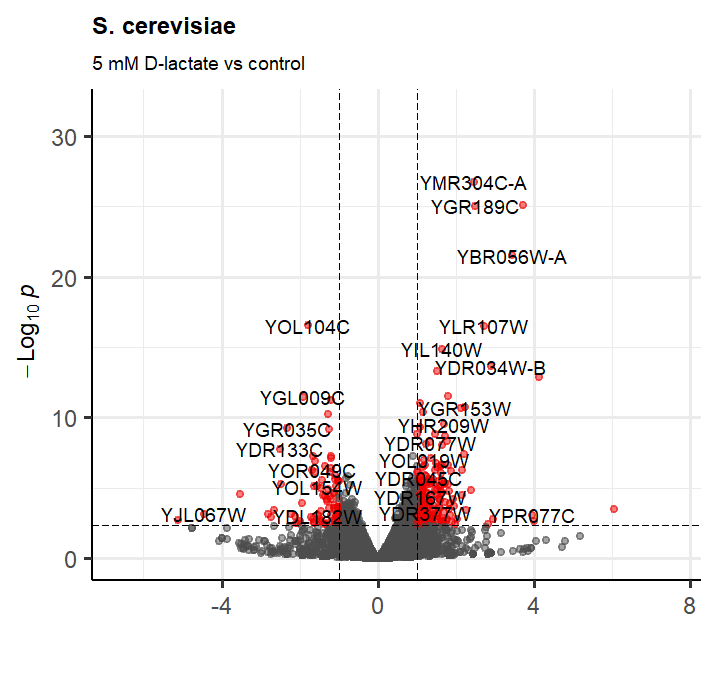
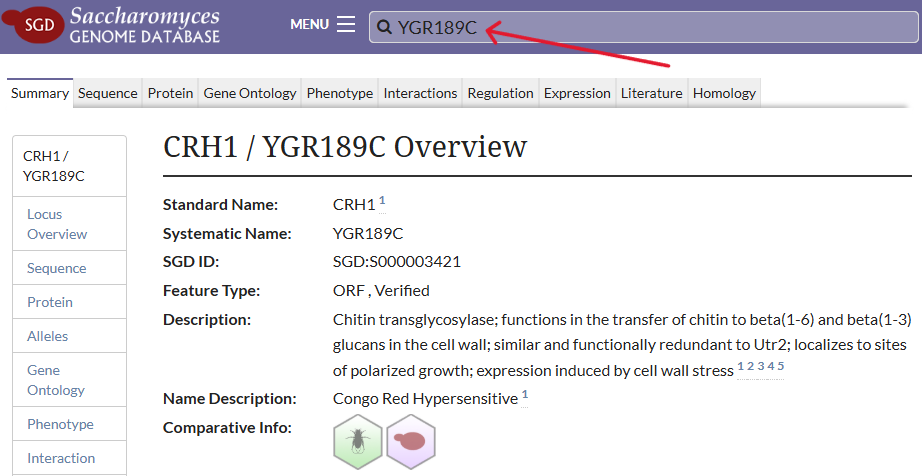

# Воспроизведение анализа статьи "Transcriptional response of Saccharomyces cerevisiae to lactic acid enantiomers"

## Резюме

В оригинальной статье рассматривается транскрипционная реакция дрожжей _Saccharomyces cerevisiae_ на энантиомеры молочной кислоты (лактата), то есть изменения транскриптома дрожжей в ответ на введение энантиомеров лактата. В данном воспроизведении вышеупомянутого исследования будет рассматриваться лишь реакция _Saccharomyces cerevisiae_ на введение D-лактата в концентрации 5 mM.

## Методы

### Использованные программы:

`R v4.3.2`;

`PuTTY v0.81`;

`NCBI SRA Toolkit v3.0.0`;

`Subread v2.0.4`

`Filezilla v1.12.1`

### Пакеты R, использованные в ходе работы:

`openxlsx`;

`ggplot2`;

`ggpubr`;

`scales`;

`BiocManager`;

`EnhancedVolcano`;

`DESeq2`

### В процессе работы на удалённых серверах bash, использовались следующие команды:

`pwd` (print working directory) - отобразить текущее расположение

`cd` (change directory) - перейти в другое расположение

`mkdir` (make directory) - Создать пустую папку в текущем расположении

`ls` (list) - просмотреть содержимое папки (по умолчанию - той, что является текущим расположением); `ls -lh` - для отображения содержимого определённой папки, например, `ls -ls /home/user/test`

`head`, `tail` - Просмотреть начало или конец файла; `head -n` или `tail -n` - для отображения конкретного количества строк сначала или с конца файла, например, `tail -n 20 file.txt`

`cat` - Просмотреть файл целиком

`grep` - Поиск текста в файле, например, `grep "seq"`

`|` - Передача вывода одной команды другой команде (pipeline)

`>` - Запись вывода команды в файл, например, `> file.txt`

`mv`, `cp` (move, copy) - Переместить или переименовать; копировать. `mv -r` и `cp -r` - для работы с конкретной папкой

`rm` (remove) - Удалить; `rm -r` - для удаления папки

`sudo` - Для запуска команд от имени администратора

`screen`- Создание экранов для запуска длительных процессов; screen `-S "ИМЯ"` - Для создания экрана; Сочетание клавиш Ctrl+A+D - для выхода из экрана; `screen -r "ИМЯ"` - для возврата к существующему экрану; `screen -ls` - для показа полного списка существующих экранов

`wget` - Для скачивания файлов из интернета на сервер с указанием гиперссылки, например `wget https://example.com/file.zip`

`ps` (process status) - Для отображения списка активных процессов; `ps aux` - для отображения полного списка процессов с подробной информацией о них

`kill` - Прервать активный процесс с указанием ID этого процесса, например, `kill 1234`


## Скачивание исходных данных:

Сначала нужно указать, где находится исполняемый файл программы sratoolkit:
`export PATH=$PATH:/media/secondary/apps/sratoolkit.3.0.0-ubuntu64/bin/`

Затем, можно начинать, собственно, скачивание данных:
```
fasterq-dump --threads 2 -A --progress SRR24466389; fasterq-dump --threads 2 -A --progress SRR24466390; fasterq-dump --threads 2 -A --progress SRR24466391; fasterq-dump --threads 2 -A --progress SRR24466380; fasterq-dump --threads 2 -A --progress SRR24466381; fasterq-dump --threads 2 -A --progress SRR24466382
```

## Выравнивание первичных прочтений на референс:

### Скачивание референсной последовательности:
```
wget https://ftp.ensembl.org/pub/release-108/gtf/saccharomyces_cerevisiae/Saccharomyces_cerevisiae.R64-1-1.108.gtf.gz wget https://ftp.ensembl.org/pub/release-108/fasta/saccharomyces_cerevisiae/dna/Saccharomyces_cerevisiae.R64-1-1.dna.tople
vel.fa.gz
```

### Распаковка архивов:
`gunzip Saccharomyces_cerevisiae.R64-1-1.dna.toplevel.fa.gz`;
`gunzip Saccharomyces_cerevisiae.R64-1-1.108.gtf.gz`;

### Построение индекса и подготовка файла с данными сплайсинга в hisat2:
`hisat2-build Saccharomyces_cerevisiae.R64-1-1.dna.toplevel.fa yeast_index`;
`hisat2_extract_splice_sites.py Saccharomyces_cerevisiae.R64-1-1.108.gtf > yeast_splice_sites.txt`

### Выравнивание с помощью hisat2 и сортировка bam-файла с помощью samtools:
```
for sample in `ls *_1.fastq`; do base=$(basename $sample "_1.fastq"); hisat2 -x yeast_index --known-splicesite-infile yeast_splice_sites.txt -p 8 -1 ${base}_1.fastq -2 ${base}_2.fastq | samtools view --threads 2 -bS | samtools sort --threads 2 -o $base.bam; done
```

## Построение графиков в среде R

### Построение пробных графиков на основе данных об активности фенолоксидазы (PO) у E. coli и E. verrucosus

```
setwd ("C:\\Users\\User\\Desktop\\VosprIssled") # Установка рабочей директории

# Загрузка необходимых пакетов:
if (!("openxlsx" %in% installed.packages())) install.packages("openxlsx")
library (openxlsx)
if (!("ggplot2" %in% installed.packages())) install.packages("ggplot2")
library (ggplot2)
if (!("ggpubr" %in% installed.packages())) install.packages("ggpubr")
library(ggpubr)
if (!("scales" %in% installed.packages())) install.packages("scales")
library(scales)

tbl <- read.xlsx("Test_table_2.xlsx", sheet = 2) # Прочтение таблицы с данными

str(tbl) # Проверка прочитанной таблицы
hist(tbl$PO.activity)
hist(tbl$GST.activity)
hist(tbl$CAT.activity)

# Построение графиков:

plot.PO <- ggplot(data=tbl, aes(x=Group, y=PO.activity, fill=Species)) +
  expand_limits(y=0) +
  geom_boxplot(show.legend = FALSE) +
  facet_wrap(~Species) +
  ylab("PO activity, a.u.") +
  xlab("") +
  theme_bw(base_size = 16) +
  theme(strip.text = element_text(face="italic")) +
  scale_fill_manual(values=c("#D2AA6D", "forestgreen")) +
  geom_jitter (width = 0.1, show.legend = FALSE)
plot.PO # Отрисовка получившегося графика
ggsave("PO_with_stats.png", device=png, width=20, height=12, units="cm") # Сохранение полученного графика в рабочей директории
```





### Построение графиков относительной скорости роста дрожжей при введении 5mM D-лактата по сравнению с контрольными условиями

```
setwd ("C:\\Users\\User\\Desktop\\VosprIssled") # Установка рабочей директории

# Загрузка необходимых пакетов:
if (!("openxlsx" %in% installed.packages())) install.packages("openxlsx")
library (openxlsx)
if (!("ggplot2" %in% installed.packages())) install.packages("ggplot2")
library (ggplot2)
if (!("ggpubr" %in% installed.packages())) install.packages("ggpubr")
library(ggpubr)
if (!("scales" %in% installed.packages())) install.packages("scales")
library(scales)

# Построение графиков:

yeast_growth_inhibition <- read.xlsx("Table_yeast_growth_DLA0500.xlsx", sheet = 1)
ggplot(yeast_growth_inhibition, aes(x=Condition, y=RGR2, fill=Condition)) +
  geom_boxplot(show.legend = FALSE) +
  geom_pwc(method="wilcox_test", label = "p.adj") +
  scale_fill_manual(values = c("forestgreen", "#ff1")) +
  scale_y_continuous(labels=comma_format(decimal.mark=",")) +
  geom_jitter (width = 0.1, show.legend = FALSE) +
  geom_pwc(method = "wilcox_test", label="p.adj") +
  ylab("Relative growth rate") +
  xlab("") +
  theme_bw(base_size = 16)
ggsave("yeast_relative_growth_rate", device=png, width=20, height=12, units="cm") # Сохранение получившихся графиков в рабочей директории
```





## Анализ дифференциальной экспрессии генов

### Указываем где находится исполняемый файл subread:

`export PATH=$PATH:/media/secondary/apps/subread-2.0.4-Linux-x86_64/bin`

### Подсчёт экспрессии:

`featureCounts -s 2 -T 2 -p -a Saccharomyces_cerevisiae.R64-1-1.108.gtf -o allSamples.featureCounts.txt $(ls *.bam)`

### Скачивание данных с удалённого сервера для их дальнейшей визуализации в R (Windows OS):

`.\pscp -P 627 2025_RR_St3@bioinformatics.isu.ru:~/allSamples.featureCounts.txt`

### Анализ дифференциальной экспрессии в R:

```
setwd ("C:\\Users\\User\\Desktop\\VosprIssled") # Установка рабочей директории

# Загрузка необходимых пакетов:
if (!("openxlsx" %in% installed.packages())) install.packages("openxlsx")
library (openxlsx)
if (!("ggplot2" %in% installed.packages())) install.packages("ggplot2")
library (ggplot2)
if (!("ggpubr" %in% installed.packages())) install.packages("ggpubr")
library(ggpubr)
if (!("scales" %in% installed.packages())) install.packages("scales")
library(scales)
if (!("BiocManager" %in% installed.packages())) install.packages("BiocManager")
library(BiocManager)
BiocManager::install("EnhancedVolcano")
BiocManager::install("DESeq2")
library(EnhancedVolcano)
library(DESeq2)

#Анализ дифференциальной экспрессии
count_table <- read.delim("allSamples.featureCounts.txt", skip=1, row.names="Geneid")
sample_table <- data.frame(condition=c("DL", "DL", "DL", "control", "control", "control"))

ddsFullCountTable <- DESeqDataSetFromMatrix(countData = count_table[,6:11], colData = sample_table, design = ~ condition)

dds <- DESeq(ddsFullCountTable)
res <- results(dds)

DEGs <- res[abs(res$log2FoldChange) > 1 & res$padj < 0.05 & complete.cases(res$padj), ]
DEGs <- DEGs[order(DEGs$log2FoldChange), ]
DEGs$Transcript <- row.names(DEGs)
library(openxlsx)
write.xlsx(x = DEGs, file = "DEGs_yeast.xlsx", rowNames = TRUE)

#Визуализация данных
EnhancedVolcano(res, lab = rownames(res),
                x = 'log2FoldChange', y = 'pvalue',
                pCutoff=0.05, pCutoffCol = 'padj', FCcutoff = 1,
                title="S. cerevisiae", subtitle="5 mM D-lactate vs control",
                col = c("grey30", "grey30", "grey30", "red2"),
                xlab="", ylab = bquote(~-Log[10] ~ italic(p)),
                caption="", selectLab = rownames(DEGs), legendPosition = 'none')
```




### Аннотация полученных результатов

На получившемся volcanoplot`е наглядно представлены изменения в экспрессии определённых генов в экспериментальных условиях, однако, чтобы сделать выводы на основе этого, нужно знать за что эти гены отвечают. В случае с Saccharomyces, можно воспользоваться Sacchromyces Genome Database: [https://yeastgenome.org].





Ниже указаны ключевые гены, экспрессия которых изменилась в экспериментальных условиях:

| Ген | Описание | Изменение экспрессии | Интерпретация |
|--------------|---------------|---------------|----------------|
| [CHR/YGR189C](https://yeastgenome.org/locus/S000003421) | Chitin transglycosylase; functions in the transfer of chitin to beta(1-6) and beta(1-3) glucans in the cell wall; similar and functionally redundant to Utr2; localizes to sites of polarized growth; expression induced by cell wall stress | Повышение | Повышение экспрессии данного гена, как правило вызвано стрессом клеточной стенки |
| [REX3/YLR107W](https://yeastgenome.org/locus/S000004097) | RNA exonuclease; required for maturation of the RNA component of RNase MRP; functions redundantly with Rnh70p and Rex2p in processing of U5 snRNA and RNase P RNA; member of RNase D family of exonucleases | Повышение | Продукт этого гена - РНК-экзонуклеаза, принимающая непосредственное участие в процессинге РНК |
| [NDJ/YOL104C](https://yeastgenome.org/locus/S000005464) | Protein that regulates meiotic SPB cohesion and telomere clustering; localizes to both spindle pole bodies (SPBs) and telomeres; required for bouquet formation, effective homolog pairing, ordered cross-over distribution, sister chromatid cohesion at meiotic telomeres, chromosomal segregation and telomere-led rapid prophase movement | Понижение | Этот ген кодирует белок, необходимый для нормального протекания мейотического деления. Понижение экспрессии этого гена, может быть причиной снижения интенсивности деления клеток |
| [LEU1/YGL009C](https://yeastgenome.org/locus/S000002977) | Isopropylmalate isomerase; catalyzes the second step in the leucine biosynthesis pathway | Понижение | Экспрессия этого гена, может быть снижена из-за высокого содержания лейцина |
| [YDR](https://yeastgenome.org/locus/S000002540) | Dubious open reading frame; unlikely to encode a functional protein, based on available experimental and comparative sequence data; partially overlaps YDR134C | Понижение | - |
| [SED1/YDR077W](https://yeastgenome.org/locus/S000002484) | Major stress-induced structural GPI-cell wall glycoprotein; associates with translating ribosomes, possible role in mitochondrial genome maintenance; ORF contains two distinct variable minisatellites; SED1 has a paralog, SPI1, that arose from the whole genome duplication | Повышение | Повышение экспрессии этого гена часто вызвано различными типами стресса, чаще всего температурным |
| [ATP17/YDR377W](https://yeastgenome.org/locus/S000002785) | Subunit f of the F0 sector of mitochondrial F1F0 ATP synthase; F1F0 ATP synthase is a large, evolutionarily conserved enzyme complex required for ATP synthesis | Повышение | Поскольку продукт данного гена является критически важным для работы АТФ-синтазы, увелечение экспресии этого гена может привести повышению интенсивности дыхания |


# Выводы

В результате данного анализа, можно заключить, что введение 5 mM D-лактата, является по большей части стрессовым факт ором, затрагивающим множество метаболических путей Saccharomyces cerevisiae, и в целом, снижает скорость и интенсивность роста и развития. Реакция saccharomyces cerevisiae проявляется на данные условия проявляется в увеличении интесивности биосинтетических и биоэнергетических процессов, которое, однако, направлено не на рост и развитие клеток, а на их адаптацию к стрессовым условиям и минимизацию получаемого от них ущерба.


